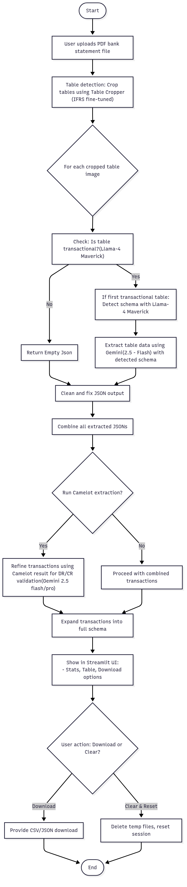

# 📑 VLM-based Bank Transaction Extractor

This project leverages **Vision Language Models (VLMs)** along with Camelot table parsing methods to extract structured transaction data from **bank statement PDFs**. It provides a hybrid AI-powered approach that combines **table detection, schema inference, and refinement** to produce clean CSV/JSON outputs.

---

## 🚀 Features

* 🔍 **Automated Table Detection** — Uses AI-based table detection to crop and extract table regions.
* 🧾 **Hybrid AI Extraction** — Combines Gemini & Llama models for accurate transaction parsing.
* 🔑 **Password-Protected PDF Support** — Unlocks secured PDFs using `fitz`.
* 📊 **Refinement with Camelot** — Cross-checks AI output with Camelot for higher accuracy.
* 📂 **Multi-format Export** — Download results in CSV and JSON formats.
---

## 🛠 Setup & Usage

### 1. Install dependencies

```bash
pip install -r requirements.txt
```

### 2. Configure API keys

Create a `.env` file in the root directory:

```env
GOOGLE_API_KEY=your_google_api_key
GROQ_API_KEY=your_groq_api_key
```

### 3. Run the Streamlit app

```bash
streamlit run vlm_extractor.py
```

### 4. Upload and Process

* Upload your **bank statement PDF** (supports password-protected files).
* View cropped table previews, raw JSON, and structured DataFrames.
* Download transactions as **CSV** or **JSON**.

---

## 📂 Project Structure

```
├── vlm_extractor.py              # Main Streamlit application
├── bank_statement_modules/
│   ├── ai_core.py                # Core AI functions (schema detection, extraction, refinement)
│   ├── table_utils.py            # PDF processing & table cropping
│   ├── file_utils.py             # File handling, JSON → DataFrame conversion
│   ├── camelot_refiner.py        # Camelot-based validation & refinement
│   ├── config.py                 # Default schema & configs
│   ├── ui.py                     # Streamlit CSS & metric rendering components
│   ├── css.py                    # (Optional) Additional styles
├── requirements.txt
├── README.md
```

---

## 🔎 Workflow

1. **Upload PDF** → Handles normal & password-protected PDFs.
2. **Table Detection** → Extracts cropped table images from statement pages.
3. **Schema Detection** → First valid transaction table is used to detect schema.
4. **AI Extraction** → VLM extracts JSON transactions from each table.
5. **Refinement** → Camelot validates and improves extracted data.
6. **Data Export** → Structured results available in CSV and JSON.



---

## 🤖 Models & Tools

* **Table Detection**: HuggingFace Table Transformer
* **Vision Language Models**:

  * Gemini-2.5-flash
  * Llama-4-Maverick-17B-128E-Instruct
* **Refinement**: Camelot (PDF table parsing)
* **Framework**: Streamlit for UI
* **PDF Handling**: fitz (PyMuPDF)

---

## 📊 Example Output

**Metrics Dashboard:**

* Total Transactions
* Total Withdrawals (₹ + count)
* Total Deposits (₹ + count)
* Withdrawal/Deposit ratio

**Export Options:**

* ⬇️ Download transactions as `transactions.csv`
* ⬇️ Download transactions as `transactions.json`

---

## 🔒 Privacy

Only cropped **table regions (Transactions)** are sent to AI models. Sensitive headers and metadata remain local.

---
